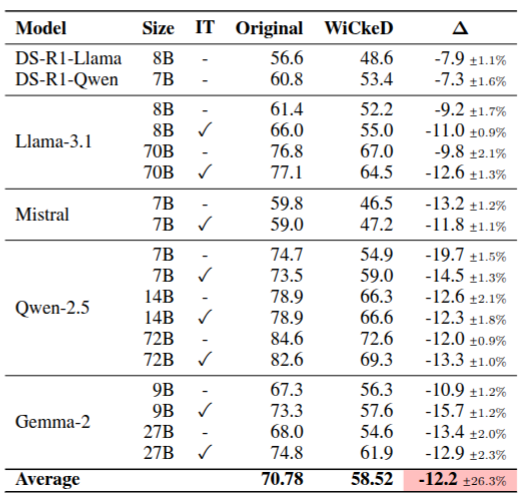
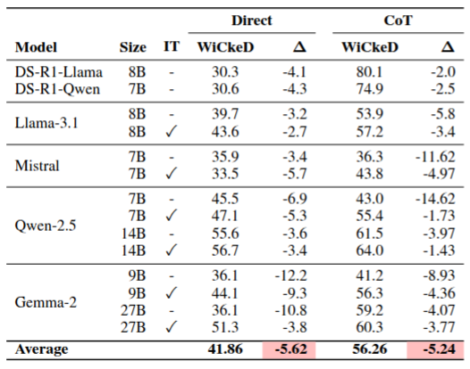

<p >
    <div style="display: flex; ">
        
        <h1 style="margin-left: 5px;">
            WiCkeD: A Simple Method to Make Multiple Choice LLM Benchmarks More Challenging
        </h1>
    </div>
<p align="center">

<!-- <a href="#"></a> -->
<!-- <a href="https://huggingface.co/ahmedselhady/bert-base-uncased-sba-clf"></a>  -->
</p>

TODO: Add the paper abstract

- 📖 Paper: [Under Review](#)

<!-- </p>     -->


------------

WiCkeD is originally implemented using the [Eval-Harness](https://github.com/EleutherAI/lm-evaluation-harness) tool.
Currently, 6 mainstream benchmarks are supported:

1. MMLU [WiCkeD Task](https://github.com/ahmedselhady/wicked/tree/main/lm-evaluation-harness/lm_eval/tasks/mmlu/default) [Paper](https://arxiv.org/abs/2009.03300)
2. MMLU-Pro [WiCkeD Task](https://github.com/ahmedselhady/wicked/tree/main/lm-evaluation-harness/lm_eval/tasks/mmlu_pro) [Paper](https://arxiv.org/abs/2406.01574)
3. MMLU-Redux [WiCkeD Task](https://github.com/ahmedselhady/wicked/tree/main/lm-evaluation-harness/lm_eval/tasks/mmlu_redux) [Paper](https://arxiv.org/abs/2406.04127)
4. AllenAI's Arc Challenge [WiCkeD Task](https://github.com/ahmedselhady/wicked/tree/main/lm-evaluation-harness/lm_eval/tasks/arc) [Paper](https://arxiv.org/abs/1803.05457)
5. Commensense QA [WiCkeD Task](https://github.com/ahmedselhady/wicked/tree/main/lm-evaluation-harness/lm_eval/tasks/commonsense_qa) [Paper](https://arxiv.org/abs/1811.00937)
6. Truthful QA - MC1 task [WiCkeD Task](https://github.com/ahmedselhady/wicked/tree/main/lm-evaluation-harness/lm_eval/tasks/truthfulqa) [Paper](https://arxiv.org/abs/2109.07958)


Models are evaluated with multiple-choice prompting and 0-shot chain of thoughts


# How it works

<p align="center">
    
</p>

Given a benchmark that consists of M examples, each has N choices: 1 correct answer and N − 1
distractors, we uniformly sample one option to be omitted, and append the wildcard option None of
the above to the remaining ones. 

:warning: **WiCkeD can break the coherence of some questions!**
Therefore, we use an automatic classifier to identify such questions and does not apply WiCked to them.

For more details, please refer to our Wickedly clever [paper](#)

# Results

## WiCkeD with Multiple Choice Prompting

<p align="center">
    
</p>

## WiCkeD with Chain of Thoughts

<p align="center">
    
</p>


# Installation

## Requirements

```
Python >= 3.8
```

## Create the virtual Environment

```
python -m venv $WORK/environments/eval-harness-env
```

## Install Eval-Harness

```
git clone https://github.com/ahmedselhady/wicked.git
cd lm-evaluation-harness
pip install -e . 
```

# Evaluation Run Scripts

Example run scripts are available [here](https://github.com/ahmedselhady/wicked/tree/main/scripts)

**N.B** For some models, you may need to add your 🤗 access token.


# Citation
 
TODO: add paper citation
```
```

